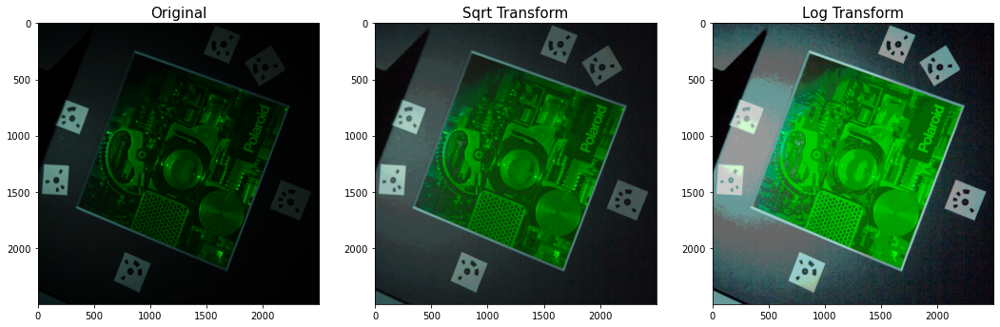

# Neural Rendering Updates (April 19, 2022)
## Limitations From Defense (Past Work)
- [ ] Train dataset --> Failed to construct COLMAP precisely
- [x] Polaroid dataset --> COLMAP works, but image itself is too dark
- [ ] Analyze interested region --> need aruco markers instead of Agisoft's marker
- [ ] Quality of rendering is not the best, yet the more the dataset, the better the result

## Dataset Brightness Analysis
| Dataset | Lion Cubs | Polaroid Original | Polaroid Cropped | Polaroid Cropped w/o Occlusion | Polaroid Cropped Sqrt Transform |
|:--:|:---:|:---:|:---:|:---:|:---:|
|Brightness|19.63|9075|20.48|23.94|52.98|
|Skewness|2.98|4.59|2.75|2.24|1.24|

*brightness = sqrt(0.299 * R^2 + 0.587 * G^2 + 0.114 * B^2)

**Brightness measure proposed by: [Recommendation ITU-R BT.709-6
(06/2015)
Parameter values for the HDTV standards
for production and international
programme exchange](https://www.itu.int/dms_pubrec/itu-r/rec/bt/R-REC-BT.709-6-201506-I!!PDF-E.pdf)

## Polaroid Dataset Square Root & Log Transform

- Log transform is quite not appropriate because log transform compress high values more aggressively compared to the square root transformation.
