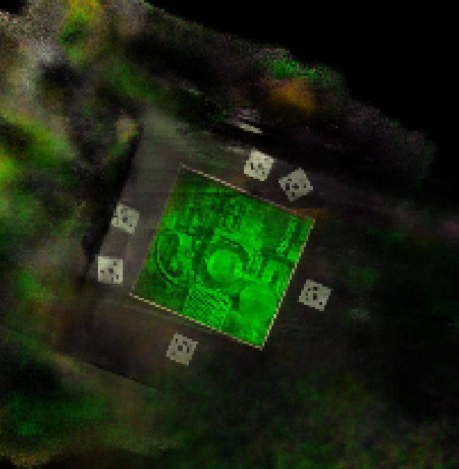

# Neural Rendering Updates (April 26, 2022)
## [NeRF TF2](https://github.com/cjw531/nerf_tf2)
- Troubleshooting: GeForce RTX 3090 (local machine) is relatively new, not compatible with [TensorFlow](https://www.tensorflow.org/) 2.x versions.
- Forked the original NeRF repository, updated the code and now fully compatible (even tensorboard).

### NeRF Output
- Applied square root pixel transformation to the polaroid dataset (interest-area cropped ver.), bight analysis refer to [`04-19-2022.md`](./04-19-2022.md).
- Resize factor 1/2, not resizing cannot be launched due to lack of system RAM
- Training up to 150000 iterations
- Rendering trajectory modified ([reference](https://github.com/kwea123/nerf_pl/blob/master/datasets/llff.py))


<hr>

## [Instant Neural Graphics Primitives](https://github.com/NVlabs/instant-ngp) (instant-ngp) by NVIDIA
- Expedited runtime of traditional NeRF by utilizing hash table.
- No quality degradation
- "Multiresolution hash encoding" method
- Stores trainable feature vectors (value that they train in the neural nets) in hash table, so lookup runtime gets reduced (approx. O(1), hash collision handled by neural nets)

<br>

<details>
  <summary>Install/Launch `instant-ngp`</summary>

  1. Satisfy [Requirements](https://github.com/NVlabs/instant-ngp#requirements) first
  2. [Compilation](https://github.com/NVlabs/instant-ngp#compilation-windows--linux) with Cmake
  3. Demo NeRF

        ```./build/testbed --scene data/nerf/fox```

        * In the local machine, `pip` dependencies are installed under conda environment named `ngp`.

</details>

<br>

<details>
    <summary>BYOD</summary>

1. Refer to [NeRF Dataset Tips]()
2. `aabb_scale` variable can be adjusted (1 to 2<sup>4</sup>). Launch below inside the image directory (image should be inside the `images/` folder)

    ```(ngp)$ python ../../instant-ngp/scripts/colmap2nerf.py --colmap_matcher exhaustive --run_colmap --aabb_scale 16```

3. Launch instant-ngp

    ```(ngp)$ ./build/testbed --mode nerf --scene ../img_dataset//```

</details>

<br>

### Instant NGP Output
Training time: around 30 seconds

| Pinecone | Lion Cubs | Polaroid Crop Sqrt |
|:--------:|:---------:|:------------------:|
||||

- Not working well with noisy captured settings or where the surface is not dense
- For hologram dataset, it captures the ray (white light) as well

