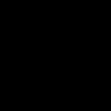

# Neural Rendering Updates (May 12, 2022)

## Exposure Equalization
### Methodology Changes
- Problem: array becomes too large, with all the pixel values with a 32-bit floating point
- Consider that x and ln(x) is proportional relation, where x = [0, 255]
- Take the median of x, before applying ln to it, with counting sort
- Take the ln, take the ln of x, and the rest of the procedure is the same

### Result
- There is no huge visual-wise changes

### Brightness & Pixel Distribution Skewness Quantitative Measures
- Metrics show that it is equalized toward more of the dark pixel value side?
- The average brightness is darker than the same set without occlsion
- Yet, pixel distribution less skewed to the dark side (values are smaller)

| Dataset | Lion Cubs | Polaroid Original | Polaroid Cropped | Polaroid Cropped w/o Occlusion | Polaroid Cropped Sqrt Transform | Polaroid Cropped w/o Occlusion & Exposure Equalization|
|:--:|:---:|:---:|:---:|:---:|:---:|:---:|
|Brightness Avg |19.63|9.75|20.48|23.94|52.98|23.4|
|Skewness Avg |2.98|4.59|2.75|2.24|1.24|2.23|

## NeRF TF2 Rendering Results
- Rendering resolution problem revisited: getting rid of the occlusion enhanced the rendered output's resolution
- Feeding the data with a various of angle is required
- There are 2 methods of rendering: (1) render along with the training; and (2) render with the demo `*.ipynb`
    1. Render during training: renders well, produce a high-resolution rendering result
    2. Render with loaded model: it does not render properly for some trained models, produce a low-resolution rendering result
- Assumption from last week revisited: the rendering path that is set at first (when the training step is firstly initiated) is getting trained as well, and the rendered output only works for this certain path?

| Polaroid Cropped | Polaroid Cropped Equalization | Polaroid Cropped <i>"Best"</i> Equalization | Polaroid Cropped Sqrt Transform|
|:--------|:---------|:------------------|:------------------|
|- Render in train: X   - Render with model: X |- Render in train: X   - Render with model: X|- Render in train: O   - Render with model: X|- Render in train: O   - Render with model: O|

*<b>"Polaroid Crop Best"</b> set is the set that does not include the occluded, dark, out-of-focus images

| Polaroid Cropped <b>Best</b> Equalization   Render in train | Polaroid Cropped <b>Best</b> Equalization   Render with model|
|:--------:|:---------:|
|||

*Note that the output image dimensions are different because the rendering with the trained model has a downsample offset set to 1/8 for the faster rendering.

### Minor TODO
- Need to fix the tensorboard to see <u>which iteration is the best for training</u>. Upgrating Tensorflow 1.x --> 2.8.0 does not connect with the tensorboard output. Yet the test set path rendering output from 50K iteration is still decent compared to 250K (recommended for LLFF scenes).