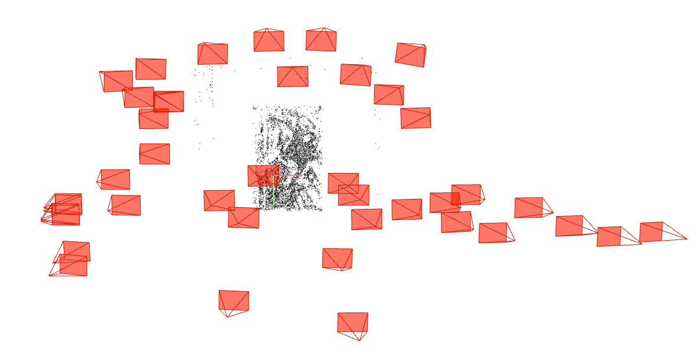

# Neural Rendering Updates (May 12, 2022)

## Rendering Trajectory Modification
How to obtain a high-quality rendering result:
- add `render_only=True` to the `config` file, and run `$ python run_nerf.py --config config_*` (similar to how you execute the training)

Code modification details

How `theta` and `zrate` works in `render_path_spiral` in [`load_llff._py`](https://github.com/cjw531/nerf_tf2/blob/master/load_llff.py#L159):
- `c = np.dot(c2w[:3,:4], np.array([np.cos(theta), -np.sin(theta), -np.sin(theta), 1.]) * rads)` --yields normal rendering result, note that `zrate` removed `z` transformation vector, to minimize unnecessary wiggling effect
- `c = np.dot(c2w[:3,:4], np.array([np.cos(theta), -np.sin(0), -np.sin(0), 1.]) * rads)` --apply `theta` to `x` only, and fix `y` and `z` transformation vector into 0-degree, and this yields horizontal movement of camera
- `c = np.dot(c2w[:3,:4], np.array([np.cos(0), -np.sin(theta), -np.sin(0), 1.]) * rads)` --apply `theta` to `y` only, and fix `x` and `z` transformation vector into 0-degree, and this yields vertical movement of camera
- `c = np.dot(c2w[:3,:4], np.array([np.cos(0), -np.sin(0), -np.sin(theta), 1.]) * rads)` --apply `theta` to `z` only, and fix `x` and `y` transformation vector into 0-degree, and this yields zoom in and out movement

### Polaroid Modified Rendering Path
| Polaroid Cropped <b>Best</b> Equalization   Default | Polaroid Cropped <b>Best</b> Equalization   Horizontal | Polaroid Cropped <b>Best</b> Equalization   Vertical |
|:--------:|:---------:|:---------:|
||||

## Spiderman Rendering
Steps:
1. Capture spiderman data
2. Capture checkerboard
3. Calibrate & Undistort images
4. COLMAP
5. NeRF

### Spiderman COLMAP Result

### Spiderman NeRF Render
