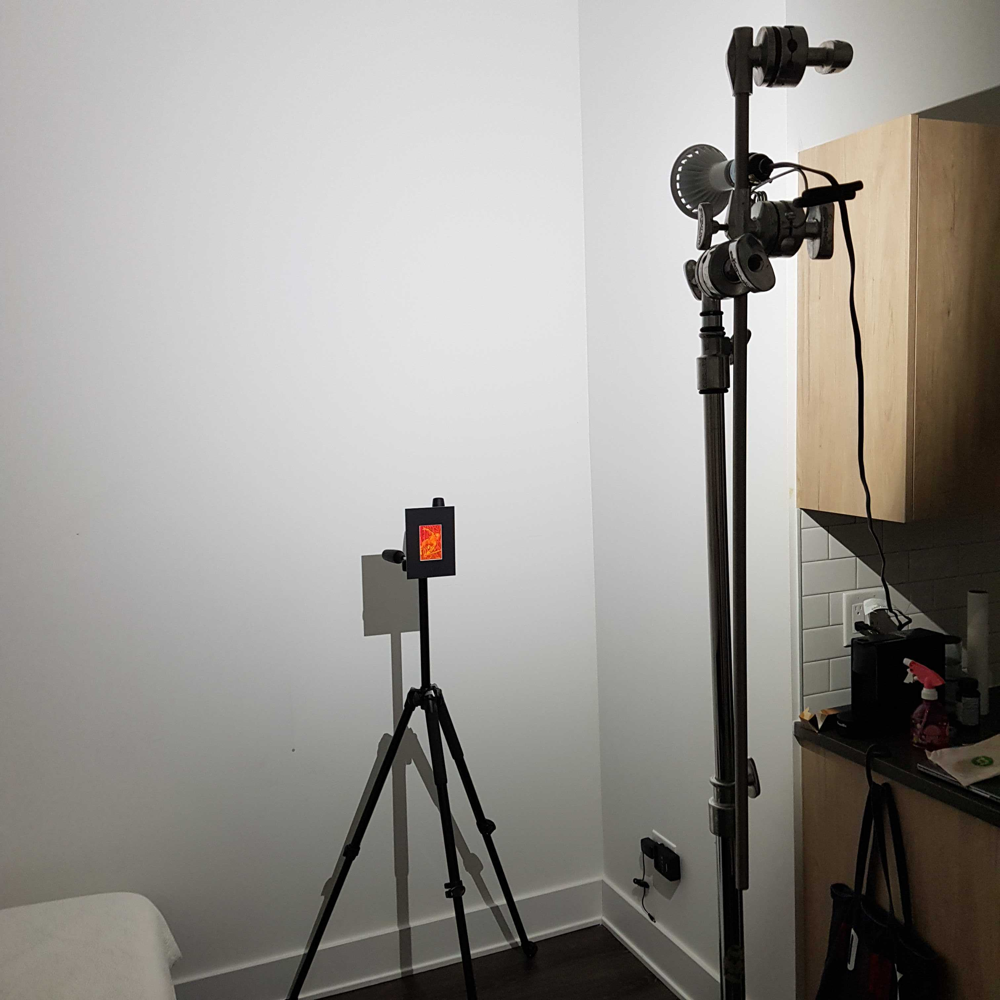
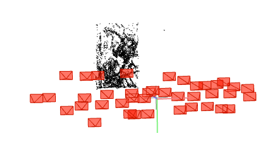

# Neural Rendering Updates (June 9, 2022)

## Rendering Trajectory
- NeRF code refer to the LLFF code, and in LLFF they describe that the camera position should be how we should take picture with gantry before. ([reference](https://github.com/Fyusion/LLFF#using-your-own-input-images-for-view-synthesis))
- Tried to capture by making the camera angle to be fixed to the front this time.

## Spiderman Capture

- The light source is around 50cm higher than the hologram, and the distance is around 80cm.
- The hologram is attached to the tripod
- Camera handheld, took pictures like the gantry movement --maybe need to put the hologram on the wall and put the camera to the tripod?

## COLMAP Output

- camera angle perpendicular to the surface/hologram
- distances are not consistent due to camera being handheld
- No camera calibration ran beforehand; but ran COLMAP --tried to test the trajectory first given that the gantry-taken ones have fixed camera center while the angle was rotating.

## Rendered Output

- Iterated only for 50k, note that the former gantry ones (lioncubs & train) were ran for 250k iterations. Still produced higher quality with 50k iter.
- Need to zoom out more to have a variety of viewing angle
- No "hotspot" effect
- No overexposures
- This camera position seems to minimize the effect of the moving center position compared to before