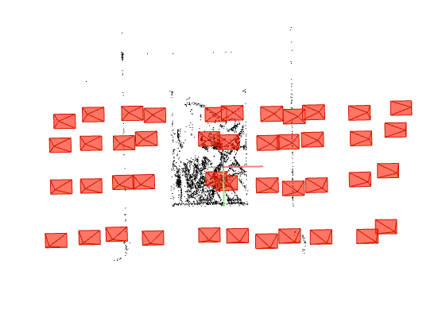
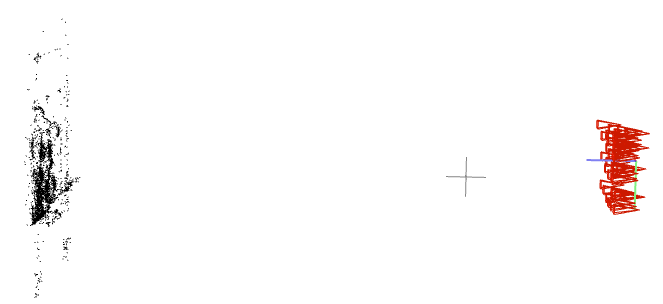
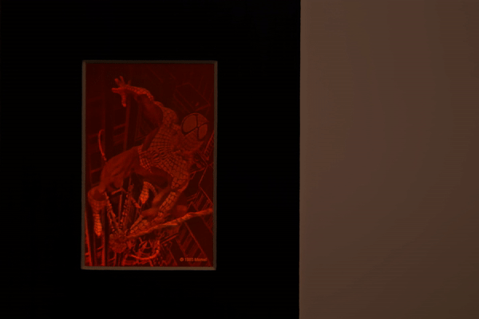
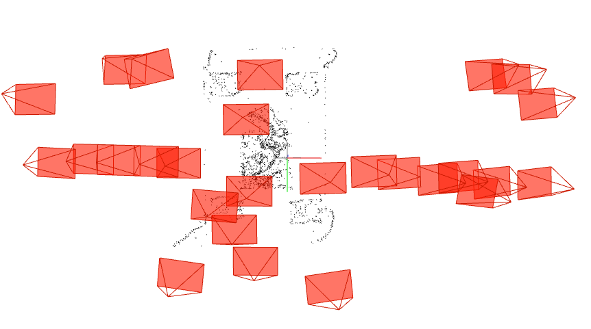
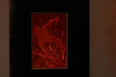
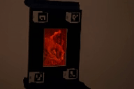

# Neural Rendering Updates (June 16, 2022)

## Gantry Images
### Claim from last week
The center of hologram on rendered output will be fixed given that if the images are captured in gantry camera movements (like how train and hologram worked).

### Gantry COLMAP Output
| Gantry COLMAP Front | Gantry COLMAP Side |
|:--------:|:---------:|
||

### Gantry Rendering Default Output

- Still the center is not fixed and the image/hologram is moving.
- Maybe the gantry was not fully fixed, so that might be the cause.

## Rendering Trajectory
### Tested 2 Dataset: Spiderman Gantry & Spiderman Spiral
| Gantry COLMAP | Spiral COLMAP |
|:--------:|:---------:|
||

- Gantry COLMAP utilized the tripod and made a movement by 1 cm around.
- Spiral COLMAP's camera was handheld and moved around multiple directions/angles.

### Modified Trajectory

| Gantry COLMAP | Spiral COLMAP |
|:--------:|:---------:|
||

- Aniket helped me out and he fixed right vector instead of up vector
- Need to play around with the `radcircle` value to adjust the rendering for each dataset.

### Hompgraphy With Aruco Markers

- The 2 aruco markers (0 and 3) can be detected for all rendered images, so these points were used to apply homography.
- The wiggling effect/non-smooth images during the gif animation is caused due to the lack of diagnoal homography points (aruco marker id 1 and 2).
- This output is more of like we fix the hologram and moving the light source around.