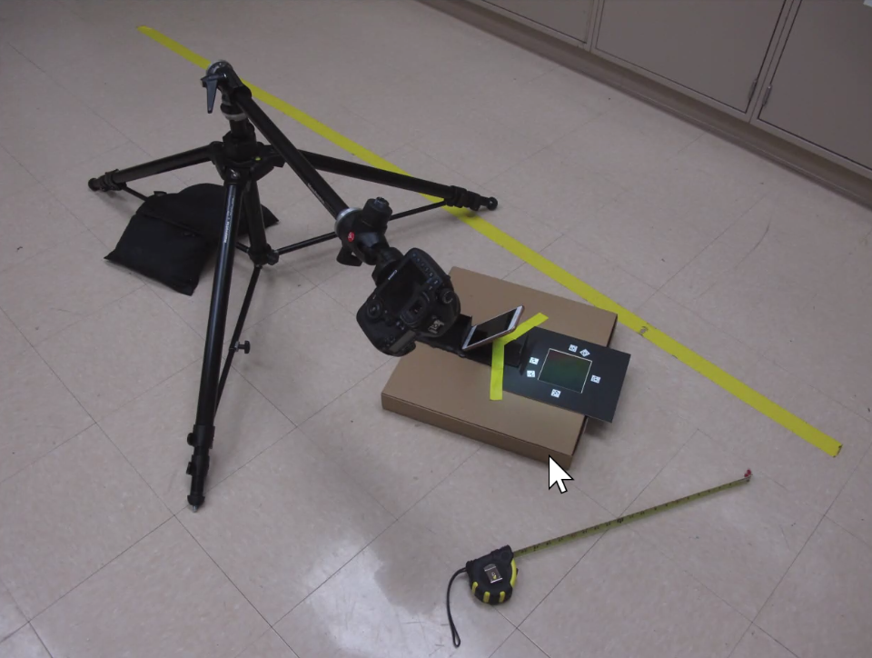
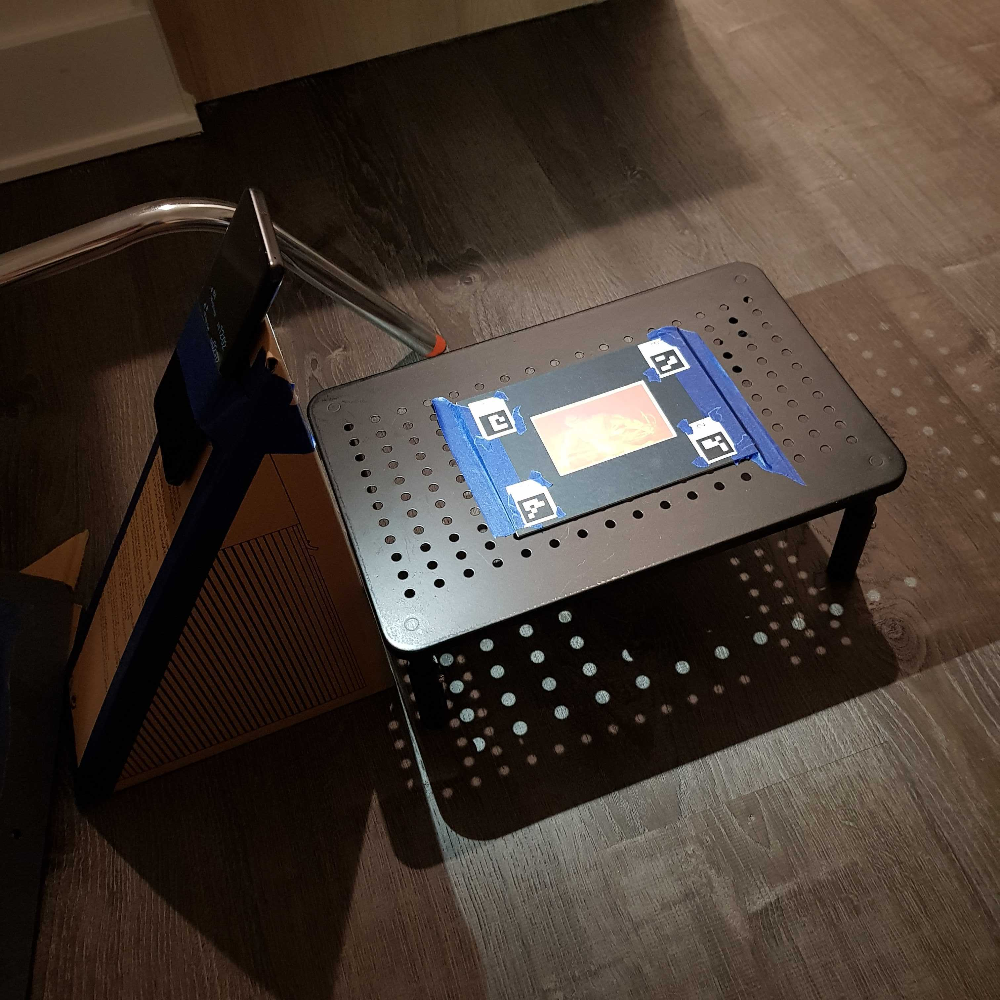

# Neural Rendering Updates (June 23, 2022)

## Pengxiao's Comments
- Benton's holograms are in general bright, the spiderman hologram seems dark as usual.
- 6s for exposure time (around 4 to 6 s)
- Aperture was set to the smallest value, f21
- Depth of field is large (20cm)
- Depth of field != viewing angle
- Some holograms  really shallow depth of field and viewing angle, and brightness.
- Put up a pinehole in front of the lightbulb since holograms are made of laysers, this will determine the depth of field.

### Polaroid Setup
- Explains why it was not able to render at first without exposure equalization or brightness adjustment.
- Phone light was used, spin around the hologram and the light source (box) with the stationary camera.

## Phone Light + (1) Phone Camera; (2) DSLR

- Both failed, image seems to be too dark
- Same problem occurred as the very first polaroid dataset
- Even applying the image exposure equalization, it failed
- Given that the polaroid setup has the light source closer to the hologram, it might explain why it worked with the exposure equalization.
- Phone light claim: it is better to use a brighter light bulb to avoid applying/modifying images after capture
- Yet the captured images with the phone camera has a pretty decent quality:
    - [Phone Light + Phone Camera](https://drive.google.com/drive/u/1/folders/1gFowV1lBW5sW9CkP1OGsf3DfuWPj1vZ2)
    - [Phone Light + DSLR camera](https://drive.google.com/drive/u/1/folders/132EaVRVFlzc71YF1Ot2aOo0hxiF1G6IH)
- Other setup details:
    - Phone Light: Samsung Galaxy S9+ (2018)
    - Phone Camera: Samsung Galaxy Note 8 (2017)
    - Box dimension: 23.5 x 35 x 42 (cm)
    - Approx. phone light angle: 33.88 degree
- Refer to image exposure histogram comparison results: [exposure_histogram.ipynb](../quantitative_measures/exposure_histogram.ipynb)