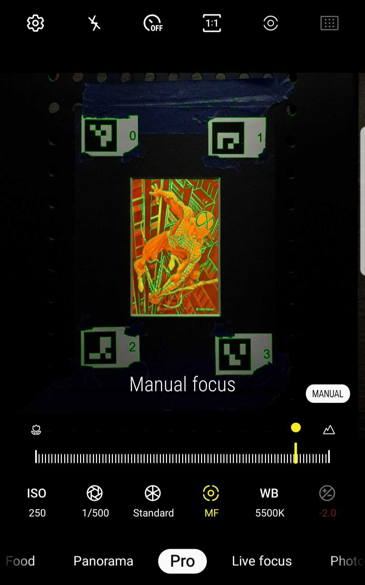

# Neural Rendering Updates (June 28, 2022)

Ideas from last week

- Preserve holograms with light field rendering (art & cultural heritage)
- Coherent images + NeRF
- In addition to the mouse-draggable rendered video, maybe project movable model to mobile phone/tablet that is tilting
- NeRF + dark imgs + denoise + superpixel (<-- can NeRF be applied to superpixel?)

## Mobile Phone Capture With Light Bulb
- Mobile phone used to capture the images (Samsung Galaxy Note 8 (2017))
- Light bulb used
- Stationary light source and the hologram, moving camera positions

### Camera Parameters

- ISO = 250
- Aperture = 1/500
- Manual Focus Mode
- White Balance = 5500K

### Rendered Result

### Misc.
- Need to put the masking tape on the phone in case where the phone is glossy and the reflected light from the hologram panel reflects again on the phone.

## Light Bulb Moving Lights
- The original image fails to get the COLMAP result
- If the COLMAP fails even with the cropped images (hologram area only), then it might be difficult to apply COLMAP as well as NeRF. Might need to consider applying NeRFMM