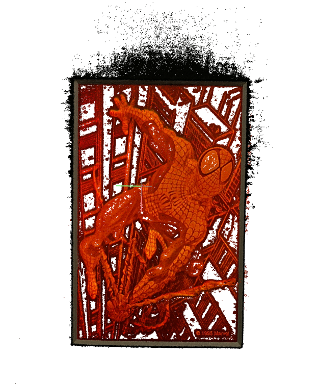

# Neural Rendering Updates (July 5, 2022)

## COLMAP Dense Point Cloud & Dense Mesh

Note that local COLMAP failed to detect CUDA toolkit although installed, so moved to Docker container file and executed there.
<details>
<summary>Execution Step Details</summary>

0. Pull docker container file from [`geki/colmap`](https://hub.docker.com/r/geki/colmap)
1. Run docker container
    ```
    sudo nvidia-docker run -v /home/jiwon/workspace:/mnt/foo -it geki/colmap
    ```
    The whole files under `workspace` will be mounted in `/mnt/foo/*` in docker environment.
    
2. Run automatic reconstructor
    ```
    colmap automatic_reconstructor --workspace_path <FILE_PATH> --image_path <FILE_PATH>/images
    ```

3. Check the following output files:
    - `<FILE_PATH>/dense/0/fused.ply` : dense point cloud data
    - `<FILE_PATH>/dense/0/meshed-poisson.ply` : dense mesh model
</details>

### Dense Point Cloud (`fused.ply`)


<hr/>

## Light Moving With Fixed Camera
### Cropped file example


### COLMAP Bundle Adjustment Failed
COLMAP failed to map the images (output from COLMAP):
```
Bundle adjustment report
------------------------
    Residuals : 167094
   Parameters : 27447
   Iterations : 19
         Time : 0.257511 [s]
 Initial cost : 0.7473 [px]
   Final cost : 0.747005 [px]
  Termination : User success

  => Merged observations: 0
  => Completed observations: 0
  => Filtered observations: 24
  => Changed observations: 0.000287
  => Filtered images: 21
  => No good initial image pair found.

Elapsed time: 1.622 [minutes]
```