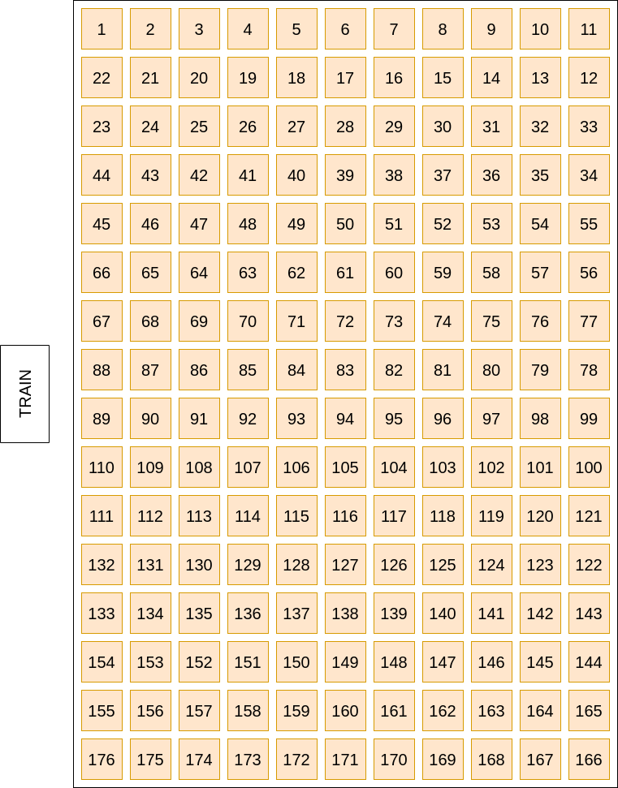
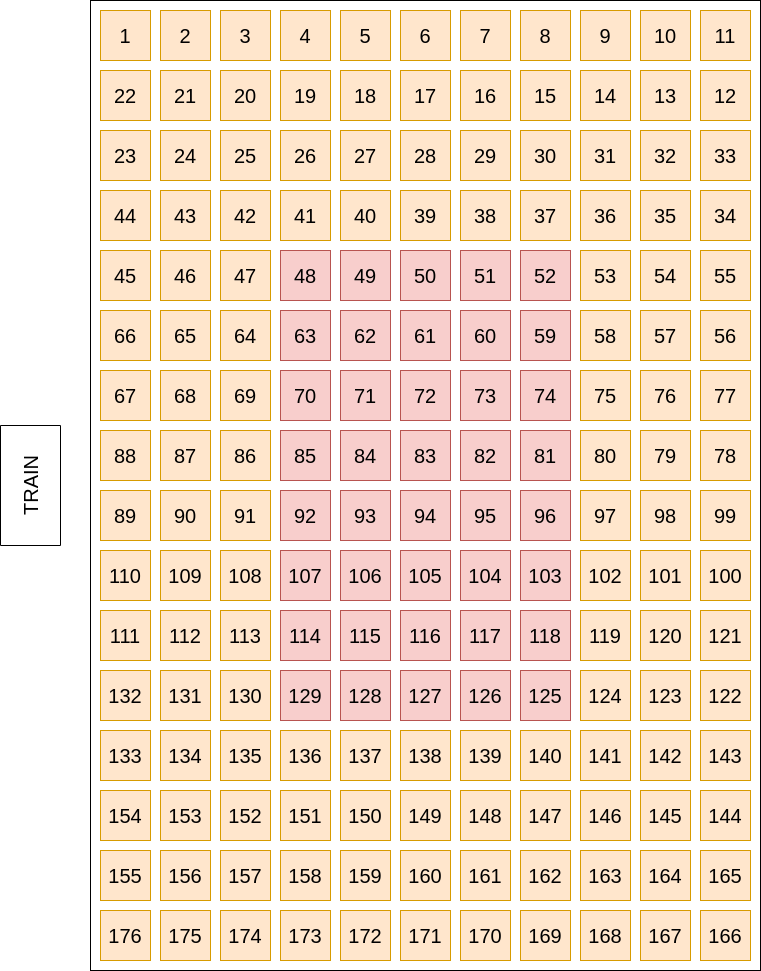
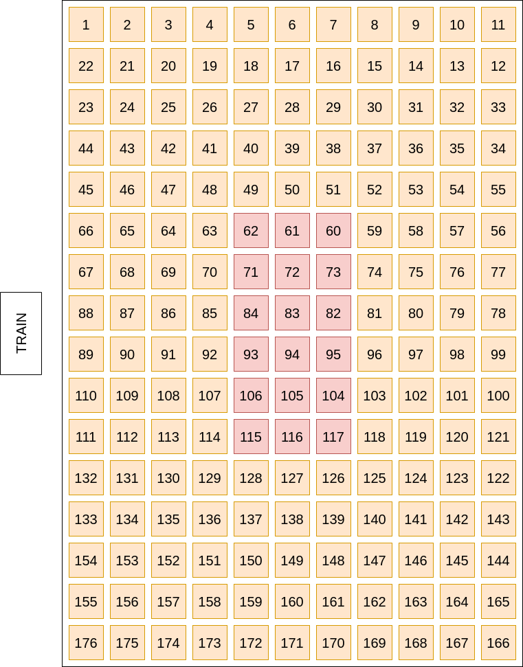
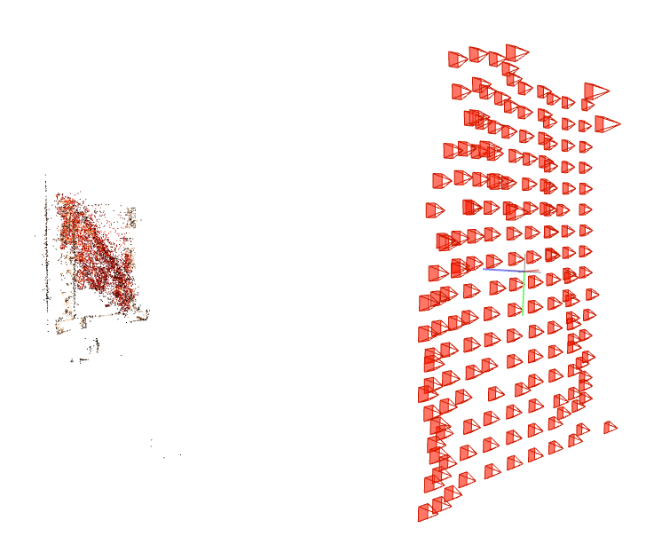
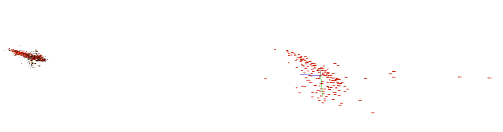
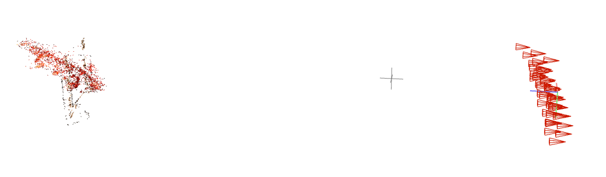
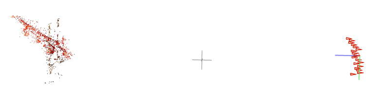

# Neural Rendering Updates (July 12, 2022)

## Train NeRF Revisited

### Train Dataset Camera Position Layouts
| Original Train | Reduced Train | Reduced 2 Train |
|:--------:|:---------:|:---------:|
||||

### Train Dataset COLMAP Output

| Original Train | Calibrated Train | Reduced Train | Reduced 2 Train |
|:--------:|:---------:|:---------:|:---------:|
|||| |

- Overall the GPU-integrated COLMAP performs better than the simple CPU-based COLMAP
- Compare the warped COLMAP output from [last time](./11-22-2021.md)

### Train Rendering Result

| Original Train | Original Log Equalized Train | Calibrated Train | Reduced Train | Reduced 2 Train |
|:--------:|:---------:|:---------:|:---------:|:---------:|
| X | X | X | X | O |

- Area of interest (area of holograph) affects NeRF?
- Minimizing the dark area improves the NeRF rendering

## Light Moving With Fixed Camera
### Steps (+Calibration)
Calibaration step added from the [last week's](./07-05-2022.md) procedure.

1. Capture train and calibration board with phone camera
2. Run calibration, undistort images
3. Crop hologram area only
4. Run COLMAP <-- failed

## Holotorch

Holotorch Tutorial

1. Example for ASM-propagator
2. Creating a Hologram using Double-Phase-Amplitude-Encoding (DPAC)
3. Near-Eye Hologram (ASM-propagation) optimization
4. Conventional Etendue Expansion with a random diffuser
5. Neural Etendue expansion (Deep Optics) with respect to an image dataset

 

Questions:
- Which simulation is relavant to us?
- How exactly NeRF + Holotorch works?