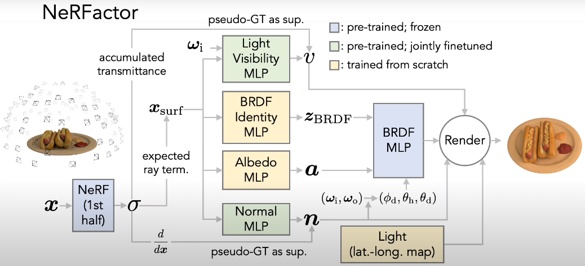
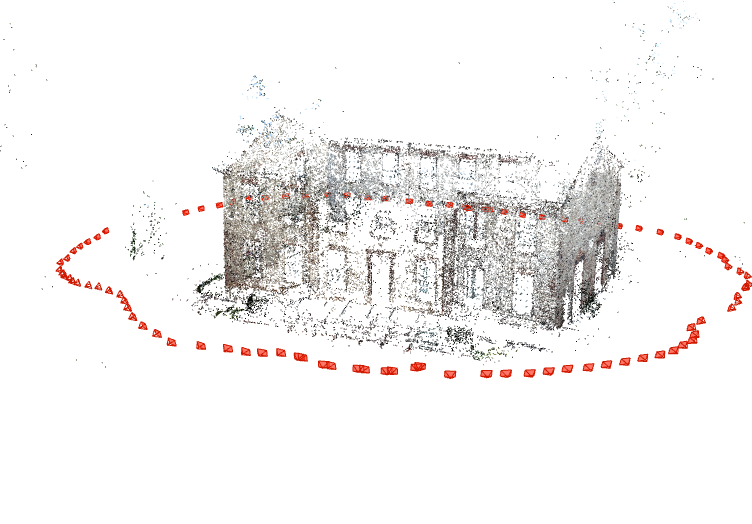

# Neural Rendering Updates (October 11, 2021)
## NeRFactor Process Flow Chart


## NeRFactor Execution Progress
- [x] 0. Data Preprocessing
- [x] 1. BRDF Prior
- [x] 2. NeRF (with input image)
- [x] 3. Geometry Buffers (optimize normal & visibility MLPs) (this takes 3+ days usually)
- [ ] 4. Joint Optimization (<u><b>ERROR OCCURS</b></u>)
    * Albedo & BRDF Identity MLP and light trained from scratch
    * Optimize along with normal and visibility from #3

## Issues In Executing View Synthetis \& Relighting Step
### 1. Out of Memory Error
- Observation: The process stop in the middle, by showing its PID and says `killed` in terminal.
- This issue was further inspected via `$ htop` command, and this process clearly exceeds memory (available memory is 94.3 GB, but it goes more than that). Note that this is the system RAM not the GPU memory.
- Things tried: reduced the batch size in config files (`*.ini`). Also tried `gc.collect` and `k.clear_session()` to manually perform garbage collection. Reducing batch size works better here, but cannot guarantee reproducing the same result.
- Reducing batch size still throws an error at the very end, so manually changed the `n_views` value in `test.py`, just to check its performance. Still throws an error as below.

### 2. Tensorflow `tf.concat` Error
```
Traceback (most recent call last):
  File "/home/jiwonchoi/nerfactor/nerfactor/test.py", line 214, in <module>
    app.run(main)
  File "/home/jiwonchoi/.conda/envs/nerfactor/lib/python3.6/site-packages/absl/app.py", line 312, in run
    _run_main(main, args)
  File "/home/jiwonchoi/.conda/envs/nerfactor/lib/python3.6/site-packages/absl/app.py", line 258, in _run_main
    sys.exit(main(argv))
  File "/home/jiwonchoi/nerfactor/nerfactor/test.py", line 196, in main
    brdf_z_override=brdf_z_override)
  File "/home/jiwonchoi/nerfactor/nerfactor/models/nerfactor.py", line 267, in call
    relight_probes=relight_probes)
  File "/home/jiwonchoi/nerfactor/nerfactor/models/nerfactor.py", line 364, in _render
    rgb_probes = tf.concat([x[:, None, :] for x in rgb_probes], axis=1)
  File "/home/jiwonchoi/.conda/envs/nerfactor/lib/python3.6/site-packages/tensorflow/python/util/dispatch.py", line 180, in wrapper
    return target(*args, **kwargs)
  File "/home/jiwonchoi/.conda/envs/nerfactor/lib/python3.6/site-packages/tensorflow/python/ops/array_ops.py", line 1606, in concat
    return gen_array_ops.concat_v2(values=values, axis=axis, name=name)
  File "/home/jiwonchoi/.conda/envs/nerfactor/lib/python3.6/site-packages/tensorflow/python/ops/gen_array_ops.py", line 1181, in concat_v2
    _ops.raise_from_not_ok_status(e, name)
  File "/home/jiwonchoi/.conda/envs/nerfactor/lib/python3.6/site-packages/tensorflow/python/framework/ops.py", line 6653, in raise_from_not_ok_status
    six.raise_from(core._status_to_exception(e.code, message), None)
  File "<string>", line 3, in raise_from
tensorflow.python.framework.errors_impl.InvalidArgumentError: OpKernel 'ConcatV2' has constraint on attr 'T' not in NodeDef '[N=0, Tidx=DT_INT32]', KernelDef: 'op: "ConcatV2" device_type: "GPU" constraint { name: "T" allowed_values { list { type: DT_INT32 } } } host_memory_arg: "values" host_memory_arg: "axis" host_memory_arg: "output"' [Op:ConcatV2] name: concat
```
- On Google, people suggest: (1) cuda version \& tensorflow version, but their `environment.yml` already has a proper vision that people say; (2) reduce batch size, but already reduced from 4 to 1 above.
- Reported this issues already in their GitHub, but still no response back since September -already noticed this error when testing with 2080Ti GPU (the `cplgpurtx` server).

<hr/>

## NeRF Execution
- GitHub: https://github.com/bmild/nerf
- Execution Flow:
  - [x] 0. Input Images (no preprocessing needed)
  - [x] 1. NeRF Optimization (training)
  - [ ] 2. Images COLMAP
  - [ ] 3. NeRF Rendering
- System Details For Running NeRF Optimization
  - Running 2 images (fern and lego rendering)
  - RAM Usage: 3.65 GB for 2 processes
  - GPU Usage: 8543 MB each
  - Relatively faster runtime: 200,000 training iteration takes 15 hours
- Model checkpoint information
  - Save as `*.npy` format, in every 10,000 iteration.
  - Saved in: `~/nerf/logs/SCENE/*`

*Note: `run_nerf.py` did not specify `os.environ['CUDA_VISIBLE_DEVICES'] = '1'` so added this line manually.

## NeRF Optimization Output
Below is the output after executing 200K iterations:
1. Disparity Map [[Video Output]](https://user-images.githubusercontent.com/25876799/136854444-04e83aa1-ca81-4ba0-bbc1-9864320907c2.mp4) [[Raw Video]](https://github.com/cjw531/neural-rendering/blob/main/nerf_output/lego/lego_test_spiral_200000_disp.mp4)
2. RGB Map [[Video Output]](https://user-images.githubusercontent.com/25876799/136854564-c5d9d2f4-d8c4-45dc-affa-a789ecb2188a.mp4) [[Raw Video]](https://github.com/cjw531/neural-rendering/blob/main/nerf_output/lego/lego_test_spiral_200000_rgb.mp4)
3. RGB Still [[Video Output]](https://user-images.githubusercontent.com/25876799/136854593-bc69e0f8-e197-4b23-8aed-4b2840b30ba6.mp4) [[Raw Video]](https://github.com/cjw531/neural-rendering/blob/main/nerf_output/lego/lego_test_spiral_200000_rgb_still.mp4)

<hr/>

## COLMAP
### 0. Installation Issue
- Installation Guide: https://colmap.github.io/install.html
- It requires sudo user permit because they download the dependency via `sudo apt-get ...`, so decided to use local machine instead of the server.
- COLMAP has GUI version in addition to CLI.
- Requires CUDA installation and uses CUDA. Not sure how well it behave with 2GB GPU in local device.
- Interestingly, COLMAP also depends on [Ceres Solver](http://ceres-solver.org/). "Ceres Solver is an open source C++ library for modeling and solving large, complicated optimization problems."

### 1. COLMAP Rendering In CLI
- COLMAP CLI Instruction: https://colmap.github.io/cli.html
- NeRF \& NeRFactor Uses: `feature_extractor` and `mapper` in their [`colmap_wrapper.py`](https://github.com/Fyusion/LLFF/blob/c6e27b1ee59cb18f054ccb0f87a90214dbe70482/llff/poses/colmap_wrapper.py#L23).
- `automatic_reconstructor` produces `*.ply` format as well that can be viewed in meshlab.
- `automatic_reconstructor` procedure cannot be completed when there is an insufficient data; but still generates `mapper` result (that can be viewed in their COLMAP GUI program):


### 2. COLMAP for NeRF
- Uses [`imgs2poses.py`](https://github.com/Fyusion/LLFF/blob/master/imgs2poses.py) in [Local Light Field Fusion](https://github.com/Fyusion/LLFF#1-recover-camera-poses).
- Camera poses needed when rendering the NeRF Image as seen in [`render_demo.ipynb`](https://github.com/bmild/nerf/blob/master/render_demo.ipynb).
- Still working on it, LLFF depends on Docker for some reason.
