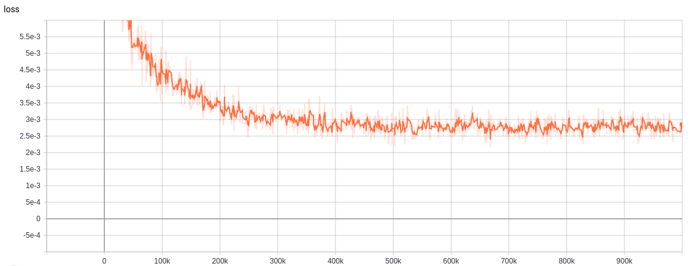

# Neural Rendering Updates (October 18, 2021)
## NeRF Execution
- GitHub: https://github.com/bmild/nerf
- Execution Flow:
  1. Input Images (no preprocessing needed)
  2. NeRF Optimization (training)
  3. Images COLMAP
  4. NeRF Rendering
- Model checkpoint information
  - Save as `*.npy` format, in every 10,000 iteration.
  - Saved in: `~/nerf/logs/SCENE/*`

### 1. Fern Dataset
- Trained with 1,000,000 iterations, and validate its overfitting result with the Tensorboard output:

- This loss plot aligns with the author's argument that training with 200K iterations is recommended.

### 2. Lego Dataset

### 3. Gerrard Hall Dataset
- This is the image dataset that was missing the top part of the building.
- This image cannot be rendered through NeRF because NeRF requires pre-COLMAP processing and need to obtain the camera position which is `poses_bounds.npy`.
- COLMAP output shows that it failed to extract the feature, and running LLFF's `imgs2poses.py` throws an error as below.

```
Traceback (most recent call last):
  File "imgs2poses.py", line 18, in <module>
    gen_poses(args.scenedir, args.match_type)
  File "/host/home/jiwon/workspace/LLFF/llff/poses/pose_utils.py", line 274, in gen_poses
Need to run COLMAP
Features extracted
Features matched
Sparse map created
Finished running COLMAP, see ../img_dataset/gerrard-hall/colmap_output.txt for logs
Post-colmap
    poses, pts3d, perm = load_colmap_data(basedir)
  File "/host/home/jiwon/workspace/LLFF/llff/poses/pose_utils.py", line 14, in load_colmap_data
    camdata = read_model.read_cameras_binary(camerasfile)
  File "/host/home/jiwon/workspace/LLFF/llff/poses/colmap_read_model.py", line 115, in read_cameras_binary
    with open(path_to_model_file, "rb") as fid:
IOError: [Errno 2] No such file or directory: '../img_dataset/gerrard-hall/sparse/0/cameras.bin'
```

### 4. Pinecone Dataset
- Successfully obtained `poses_bounds.npy` via COLMAP and LLFF.
  
<hr/>

## LLFF Camera Pose
### 0. Installation
- Before following [these steps](https://github.com/Fyusion/LLFF#installation-tldr-setup-and-render-a-demo-scene) in LLFF, [docker](https://docs.docker.com/engine/install/ubuntu/#install-using-the-repository) and [nvidia-docker](https://medium.com/@linhlinhle997/how-to-install-docker-and-nvidia-docker-2-0-on-ubuntu-18-04-da3eac6ec494) installation were needed.

### 1. Execution
- Run the following single-command in LLFF directory, to obtain `poses_bounds.npy`:
```
$ sudo nvidia-docker run --rm --volume /:/host --workdir /host$PWD tf_colmap python imgs2poses.py <IMG_DATASET_PATH>
```
- Running the auto-command does not work, throws segmentation fault (unnecessary anyways):
```
$ sudo nvidia-docker run -it --rm --volume /:/host --workdir /host$PWD tf_colmap
```
```
demo.sh: line 24: 106 Segmentation fault (core dumped) cuda_renderer/cuda_renderer data/testscene/mpis_360 data/testscene/outputs/test_path.txt data/testscene/outputs/test_vid.mp4 360 .8 18
```
- Minimum GPU RAM is 4GB, while the local has 2GB memory, and throws OOM error if multiple commands are running together [(Reference)](https://github.com/Fyusion/LLFF/issues/11#issuecomment-515771554).
- Tried [edits suggested](https://github.com/Fyusion/LLFF/issues/11#issuecomment-516905659) under the GitHub issue, which is reducing the network patch, but did not work.

<hr/>

## COLMAP Rendering
- COLMAP Rendering can be obtained with the [following CLI](https://colmap.github.io/cli.html).
- For the advanced rendering (other than `mapper`, but `*.ply` models), [CUDA toolkit](https://linuxconfig.org/how-to-install-cuda-on-ubuntu-20-04-focal-fossa-linux) is needed (7.X higher).
### 1. Pinecone
- Pinecone `mapper` output:
