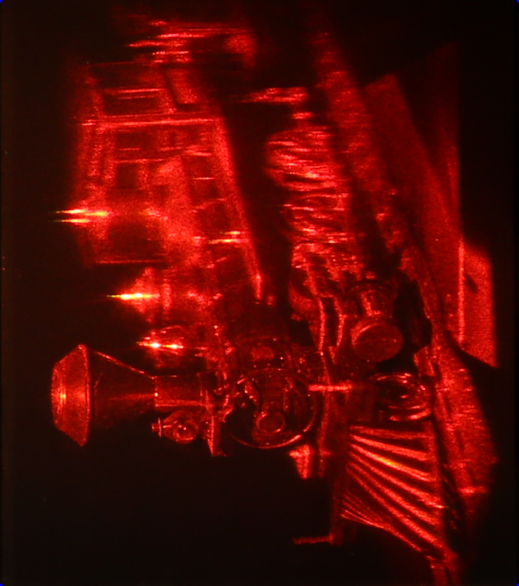
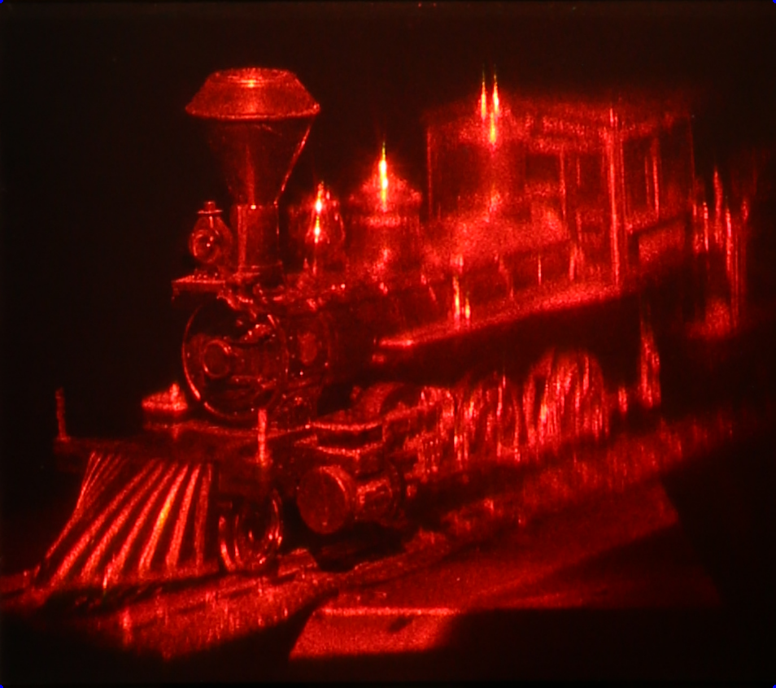

# Neural Rendering Updates (October 25, 2021)
## NeRF Execution On Holography Image
- GitHub: https://github.com/bmild/nerf
- Execution Flow:
  - [x] 0. Holography Image Preprocessing
  - [ ] 1. Obtain `poses_bounds.npy` via COLMAP ... **FAILED**
  - [ ] 2. NeRF Optimization (training)
  - [ ] 3. NeRF Rendering
- Model checkpoint information
  - Save as `*.npy` format, in every 10,000 iteration.
  - Saved in: `~/nerf/logs/SCENE/*`

### 0. Holography Image Preprocessing
1. Detect Markers
2. Crop Image
3. Rotate Image
   
|                Marker Detection                 |                 Corners Calculated                 |              Cropped Image              |             Image Rotation              |
| :---------------------------------------------: | :------------------------------------------------: | :-------------------------------------: | :-------------------------------------: |
|  |  |  |  |

- Steps Overview with Examples: [`preprocessing_example.ipynb`](../image_preprocessing/preprocessing_example.ipynb)
- Holography Image Preprocessing Script: [`hologram_preprocessing.py`](../image_preprocessing/hologram_preprocessing.py)
- Preprocessing Execution:
    ```
    python hologram_preprocessing.py <imread_directory> <imsave_directory>
    ```
- The marker in the image is not the typical ARUCO markers. Thus, cannot be detected with [aruco library](https://mecaruco2.readthedocs.io/en/latest/notebooks_rst/Aruco/aruco_basics.html).
- Current marker detection logic is detecting circles in the center of the marker. Circle sizes are hardcoded. Works well so far, but is there ways to detect these markers in a better/general way?
- Camera calibrations were already done, so hardcoded the 4 corner locations based on 6 markers.
- Since camera calibrations were already done, skipped [homography](https://towardsdatascience.com/image-processing-with-python-applying-homography-for-image-warping-84cd87d2108f).
- Only works when all 6 markers are present. Thus, resulted total of [137 images](https://drive.google.com/drive/folders/1AAlhv9hI8t5CxBMnPq7IHINVXV3DPsmW?usp=sharing), out of [176 images](https://drive.google.com/drive/folders/1Wj7oFXP-Vmd_AzkEq4NGGQHH8x1vM3nF?usp=sharing).

### 1. COLMAP Camera Poses
- TL;DR> Failed to obtain camera poses
- Requested more information about position relative to the hologram panel.
- COLMAP output:
  ```
  ERROR: the correct camera poses for current points cannot be accessed
  ```
- Approaches taken:
  1. Automatic COLMAP CLI 3xecution ([Reference](https://colmap.github.io/cli.html))
        
        Failed; unable to register images.
        ```
        $ DATASET_PATH=/path/to/project
        $ colmap automatic_reconstructor \
            --workspace_path $DATASET_PATH \
            --image_path $DATASET_PATH/images
        ```
  2. COLMAP line-by-line execution ([Reference](https://github.com/Fyusion/LLFF/issues/36#issuecomment-648018595))

        Failed; same reason as above, failed in `mapper`.
        ```
        $ DATASET_PATH=/path/to/project
        $ colmap feature_extractor --database_path $DATASET_PATH/database.db --image_path $DATASET_PATH/images
        $ colmap sequential_matcher --database_path $DATASET_PATH/database.db
        $ colmap mapper --database_path $DATASET_PATH/database.db --image_path $DATASET_PATH/images --output_path $DATASET_PATH/sparse
        ```
  3. [LLFF](https://github.com/Fyusion/LLFF) `imgs2poses.py`

        Failed; COLMAP `mapper` failed to get positions.
        ```
        sudo nvidia-docker run --rm --volume /:/host --workdir /host$PWD tf_colmap python imgs2poses.py <IMG_DATASET_PATH>
        ```