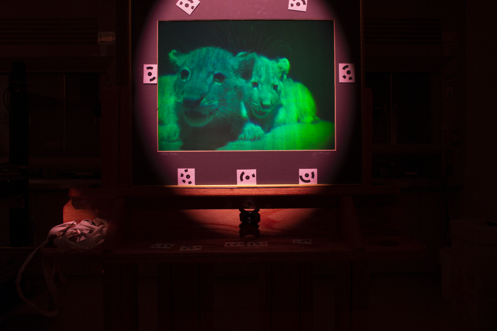
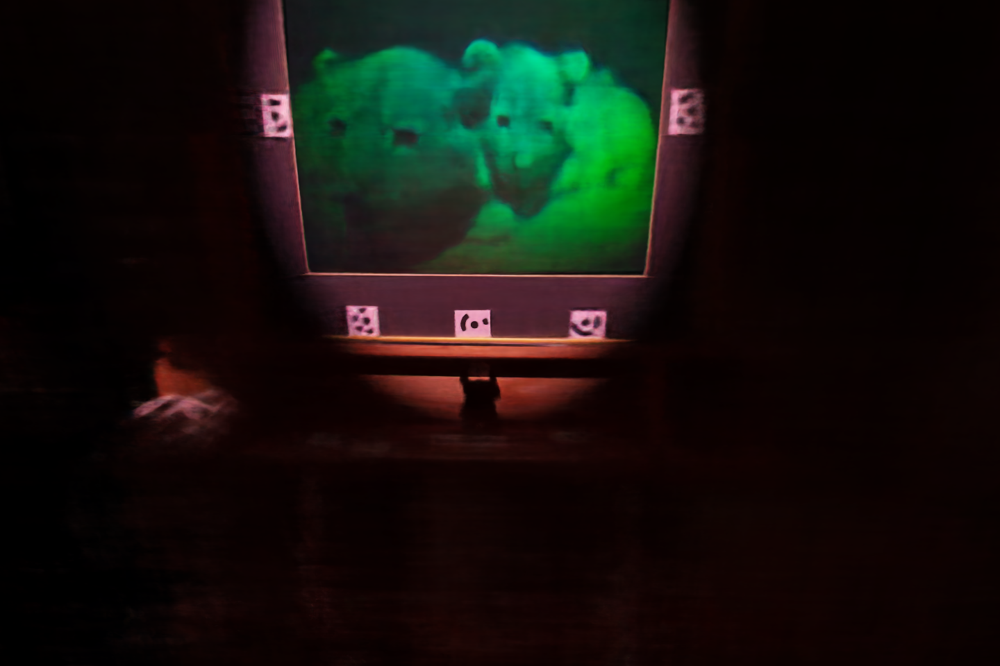
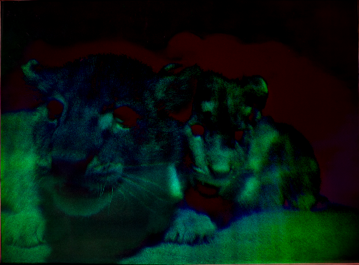
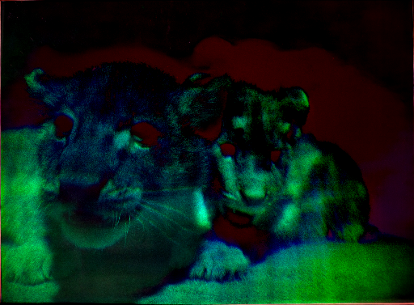

# Neural Rendering Updates (November 15, 2021)
## Lion Dataset Quantitative Analysis

| Ground Truth                                               | Rendered                                          |
| ---------------------------------------------------------- | ------------------------------------------------- |
|  |  |

### 1. PSNR & SSIM Result
- PSNR = 28.61
- SSIM = 0.4924
- LPIPS = 0.6069

Compared to PSNR results of other scenes:
|      |       | Synthetic Dataset |       |       | Real Forward-Facing Dataset |       |
| ---- | :---: | :---------------: | :---: | :---: | :-------------------------: | :---: |
|      | PSNR  |       SSIM        | LPIPS | PSNR  |            SSIM             | LPIPS |
| LLFF | 24.88 |       0.911       | 0.114 | 24.13 |            0.798            | 0.212 |
| NeRF | 31.01 |       0.947       | 0.081 | 26.50 |            0.811            | 0.250 |

- PSNR, SSIM: higher is better
- Learned Perceptual Image Patch Similarity (LPIPS): lower is better

### 2. Grayscale difference calculation
(ImgA - ImgB) * gain + 0.5 
= (`ground_truth` - `rendered`) * gain + 0.5

| gain=150                                                  | gain=250                                                  | gain=350                                                  | gain=500                                                  |
| --------------------------------------------------------- | --------------------------------------------------------- | --------------------------------------------------------- | --------------------------------------------------------- |
|  |  |  |  |