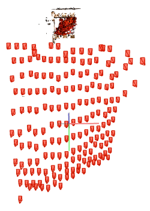
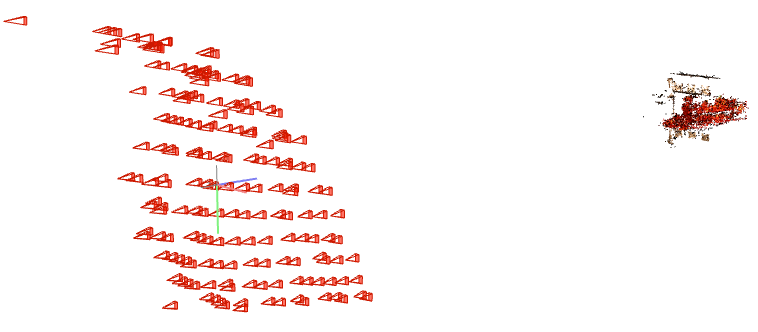
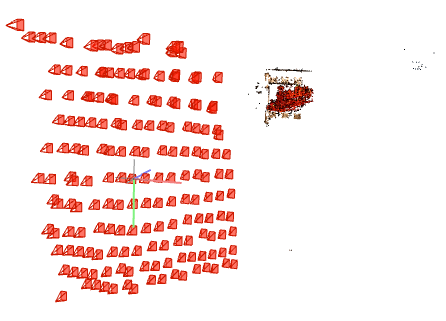
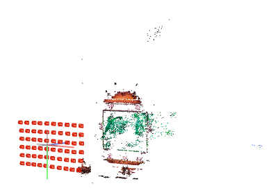
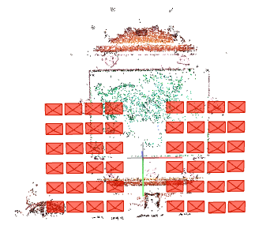
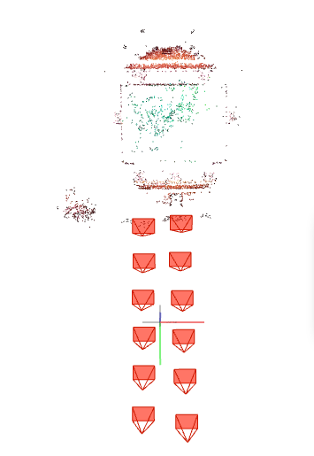
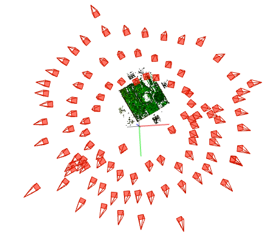
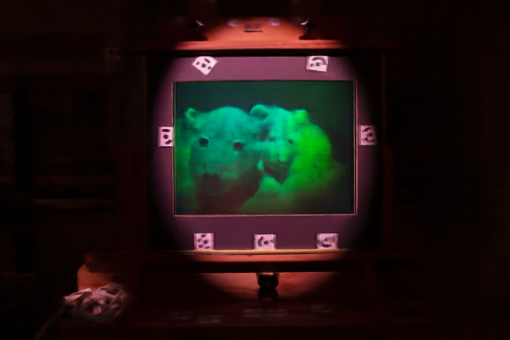

# Neural Rendering Updates (November 22, 2021)
## COLMAP Revisited
For some reason, COLMAP works for other datasets. 
Not surprisingly, COLMAP works well when the camera captured the large portion of interest area.
### Train Raw COLMAP
| Front                                                                | Side                                                         | 45-degree                                                           |
| -------------------------------------------------------------------- | ------------------------------------------------------------ | ------------------------------------------------------------------- |
|  |  |  |

### Lioncubs COLMAP
| Front                                              | Side                                               |
| -------------------------------------------------- | -------------------------------------------------- |
|  |  |

### Lioncubs 8:2 Split COLMAP
| Sides (0.8)                                                     | Center Column (0.2)                                             |
| --------------------------------------------------------------- | --------------------------------------------------------------- |
|  |  |

### Polaroid COLMAP

## NeRF Revisited
### Pipeline
1. COLMAP
2. If necessary, copy obtained COLMAP poses to the cropped data (in case of train)
3. NeRF
4. Analysis

### Train NeRF
- TL;DR> Failed
- Training PSNR is around 20-22.
- Methodology: obtained COLMAP poses from the raw dataset, copy the poses to the cropped & registered dataset and run NeRF.

### Polaroid NeRF
- TL;DR> Failed
- Training PSNR is around 18-19.
- Producing black image rendering result.

### Lioncubs & Lioncubs Partial(0.8) NeRF
- Worked well.
- Below is the frontal image only.
- Training PSNR resulted around 36-39 for both.

| Full Dataset                            | Partial Dataset (0.8)                            |
| --------------------------------------- | ------------------------------------------------ |
|  |  |

Ground Truth

