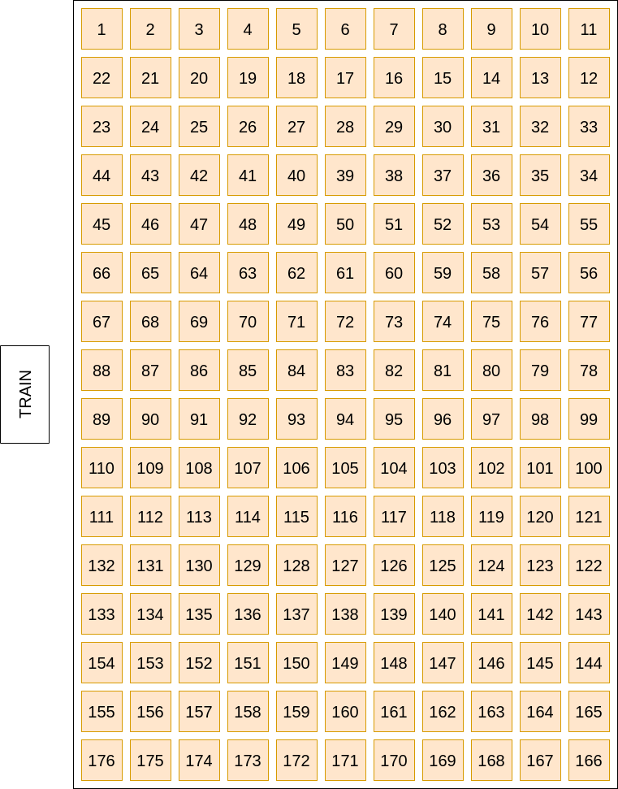
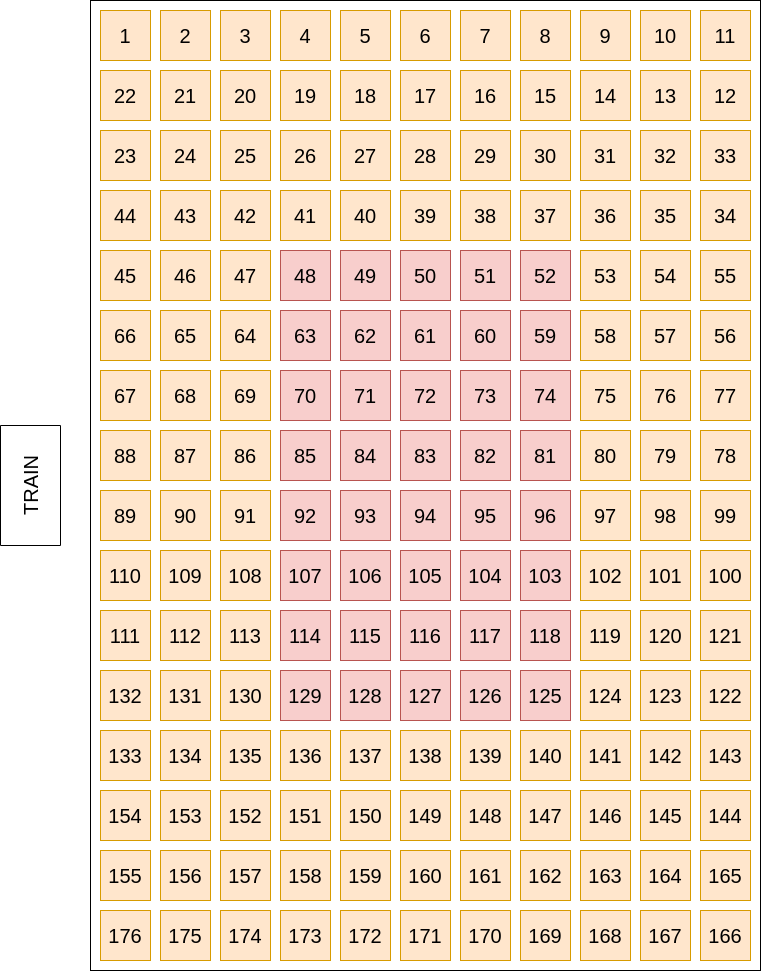
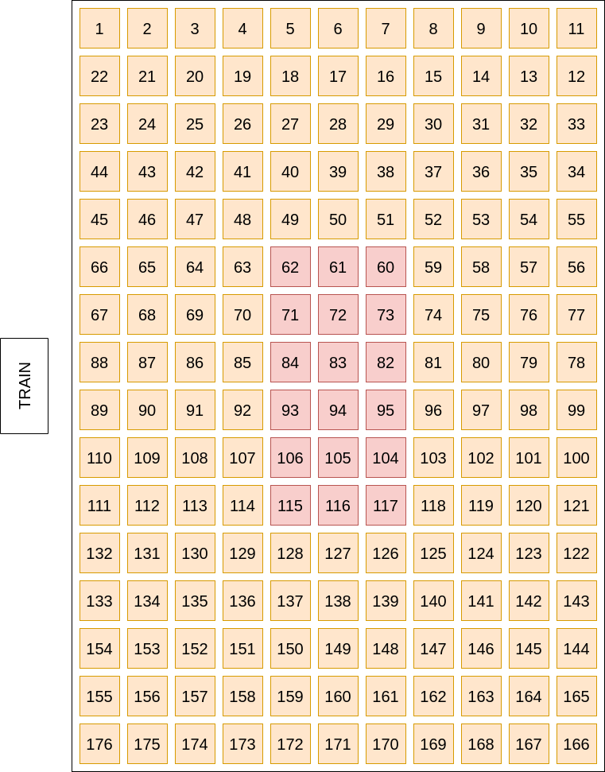
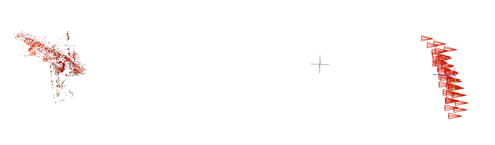

# Neural Rendering for Holography 2022 Updates

## Polaroid Dataset Improvement
- Problem from thesis: captured holograms are too dark
- Solution: transform pixel values to 1 to make images equallly brighter

  
Image Pixel Exposure Equalization Steps In Detail

  1. Image (r,g,b) pixel values --> 32-bit float format
  2. Find global median value after merging all (r,g,b) pixel values of all captured image data
  3. Apply ln(x) to all pixel values (r,g,b)
  4. Get each image's median value of pixel (r,g,b)
  5. Get offset value of each image: offset_i = (global median) - (local median)
  6. For i-th img, add offset_i to each pixel value (r,g,b)
  7. Replace the value back by doing e^(pixel), where pixel is (r,g,b)

 

### Exposure Equalized Before/After Comparison

| Original | Exposure Equalized |
|:--------:|:---------:|
|||

### Output
Previously black output, now renders:

Problem: unlike lion cubs rendered output, the center point is not fixed

## Rendering Trajectory Issue
Problem:
- NeRF code refer to the LLFF code, and in LLFF they describe that the camera position should be how we should take picture with gantry before. ([reference](https://github.com/Fyusion/LLFF#using-your-own-input-images-for-view-synthesis))
- Thus, it explains why train and lion cubs had a center point fixed rendered output while did not work for spiral camera positions without gantry.

Solution: fix the right vector instead of up vector

| Original | Rendering Trajectory Modified |
|:--------:|:---------:|
|||

## Capture Holography Images With Phone

| Lightbulb + DSLR | Lightbulb + Phone Camera | Phone Light + DSLR |  Phone Light + Phone Camera |
|:--------:|:---------:|:---------:|:---------:|
| O | O | X | X |

- Phone light cannot overcome the dark image and fail to render
- Capture setup details for phone light ([reference](https://github.com/cjw531/neural-rendering/blob/main/notes/06-23-2022.md#phone-light--1-phone-camera-2-dslr))
- Capture setup details for phone camera ([reference](https://github.com/cjw531/neural-rendering/blob/main/notes/06-28-2022.md))

## Spiderman

| Spiral Spiderman (Phonecam) | Spiral Spiderman Trajectory Modified (Phonecam) | Gantry Spiderman Trajectory Modified (DSLR) |
|:--------:|:---------:|:---------:|
|  |  |  |
|  |  |  |

*Training iteration: 50K yet high quality; thesis was 250k and the recommendation iter was also 250k from the author

## COLMAP
Problem: 
- Cannot retrieve dense COLMAP output
- Dense COLMAP execution requried better GPU while back then it was 2GB VRAM 
- CUDA toolkit failed to load/detect

Solution: 
- GPU now with 24GB VRAM
- Moved to Docker container instead of running it on local

### Spiderman Dense Point Cloud (fused.ply)

## Train

### Train Dataset Camera Position Layouts
| Original Train | Reduced Train | Reduced 2 Train |
|:--------:|:---------:|:---------:|
||||

### Train Dataset COLMAP Output

| Original Train | Img Calibrated Train | Reduced Train | Reduced 2 Train |
|:--------:|:---------:|:---------:|:---------:|
|||| |

- Overall the GPU-integrated COLMAP performs better than the simple CPU-based COLMAP
- Compare the warped COLMAP output from [last time](./11-22-2021.md)

### Train Rendering Result Overview

| Original Train | Original Log Equalized Train | Img Calibrated Train | Reduced Train | Reduced 2 Train |
|:--------:|:---------:|:---------:|:---------:|:---------:|
| X | X | X | X | O |

- Area of interest (area of holograph) affects NeRF
- Minimizing the dark area improves the NeRF rendering

### Reduced 2 Train Rendering Result

*Since this was captured in gantry setting, we do not need to modify rendering trajectory
**The noise part (bright part) still bright in rendered output